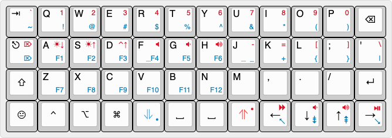

# ZMK Config for Boardsource 4x12 Ortho

This project is a config for a custom ZMK Shield supporting the Boardsource [4x12 Ortho](https://boardsource.xyz/store/5ecb78d286879c9a0c22dafd) and [4x12 Ortho (LP)](https://boardsource.xyz/store/5ecb7dad86879c9a0c22db32) keyboards. The shield overlay and configuration files were based on the existing shield for the [5x12 Ortho](https://boardsource.xyz/store/5ecb802c86879c9a0c22db61). The keymap was modeled after the [Planck](https://qmk.fm/keyboards/planck/) and [Planck EZ](https://www.zsa.io/planck/) layouts with some customizations.

## Keymap Features and Customizations

- Bluetooth connection keys on the ADJUST layer
- macOS specific screenshot keys on the ADJUST layer
- macOS function keys for volume, media, and display brightness (Tested on macOS Ventura 13.2.1)
- Tap-Dance Meh / Hyper key for custom keyboard shortcuts
- Tap-Dance Left-Shift / Caps Word key for less strain when typing in ALL_CAPS
- Mod-Morph Backspace / Delete key using Left-Shift
- Swappable layouts for Qwerty, Colemak, Dvorak, and Workman
